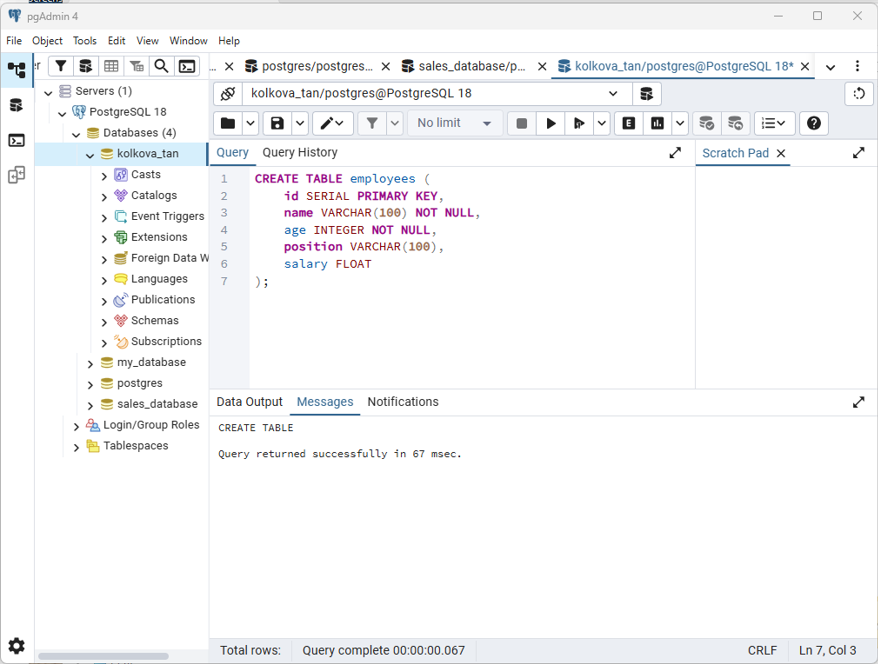
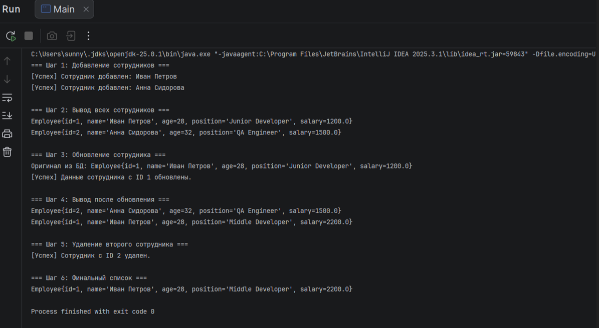

# Робота з базою даних за допомогою JDBC в Java

Цей проєкт є виконанням практичного завдання з налаштування підключення до бази даних **PostgreSQL** за допомогою **JDBC (Java Database Connectivity)** та реалізації базових операцій **CRUD** (Create, Read, Update, Delete).

## 🚀 Стек технологій
* **Java** (версія 17/21)
* **PostgreSQL** (версія 18)
* **JDBC Driver** (org.postgresql)
* **Maven** (система збирання проєкту)
* **IntelliJ IDEA** (середовище розробки)

## 📁 Структура проєкту
Проєкт розбито на класи відповідно до архітектурного шаблону DAO (Data Access Object):
* `DatabaseConnector.java` — менеджер підключення до БД (керує Driver Manager).
* `Employee.java` — клас-модель (POJO), що описує сутність співробітника.
* `EmployeeDAO.java` — інтерфейс/клас взаємодії з БД (виконує SQL-запити через PreparedStatement).
* `Main.java` — точка входу для демонстрації роботи програми та CRUD-операцій.

---

## 🛠️ Скрипт для створення таблиці

Для створення необхідної структури в pgAdmin (база даних `kolkova_tan`) було виконано наступний скрипт:

```sql
CREATE TABLE employees (
    id SERIAL PRIMARY KEY,
    name VARCHAR(100) NOT NULL,
    age INTEGER NOT NULL,
    position VARCHAR(100),
    salary FLOAT
);
```

---

## 📸 Результати виконання (Скріншоти)

### 1. Структура бази даних у pgAdmin
Нижче наведено скріншот успішно створеної таблиці `employees` та її колонок у СУБД:


### 2. Лог виконання програми в IntelliJ IDEA
Консоль відображає покрокове виконання додавання, оновлення, виведення та видалення записів:

